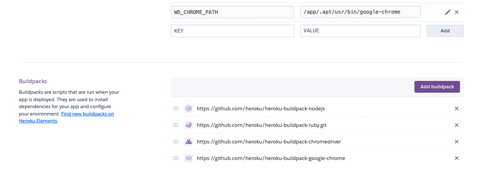

# No Mas Tamizaje 
This is a Rails application, initially generated using [Potassium](https://github.com/platanus/potassium) by Platanus.

# Warning :warning:
This application needs your UC credentials. This is sensible information, so therefore, it is strongly recommended that you self-host the project.

If you do not want to self-host (and you trust me), you can use my application at tamizaje.herokuapp.com

## Self-hosting information
Everything is setup to be hosted in Heroku.

You have to make sure you have the `WD_CHROME_PATH` and the proper buildpacks.

## Local installation

Assuming you've just cloned the repo, run this script to setup the project in your
machine:

    $ ./bin/setup

It assumes you have a machine equipped with Ruby, Node.js, Docker and make.

The script will do the following among other things:

- Install the dependecies
- Create a docker container for your database
- Prepare your database
- Adds heroku remotes

After the app setup is done you can run it with [Heroku Local]

    $ heroku local

[Heroku Local]: https://devcenter.heroku.com/articles/heroku-local

## Continuous Integrations

The project is setup to run tests
in [CircleCI](https://circleci.com/gh/platanus/no-mas-tamizaje/tree/master)

You can also run the test locally simulating the production environment using [CircleCI's method](https://circleci.com/docs/2.0/local-cli/).

## Style Guides

Style guides are enforced through a CircleCI [job](.circleci/config.yml) with [reviewdog](https://github.com/reviewdog/reviewdog) as a reporter, using per-project dependencies and style configurations.
Please note that this reviewdog implementation requires a GitHub user token to comment on pull requests. A token can be generated [here](https://github.com/settings/tokens), and it should have at least the `repo` option checked.
The included `config.yml` assumes your CircleCI organization has a context named `org-global` with the required token under the environment variable `REVIEWDOG_GITHUB_API_TOKEN`.

The project comes bundled with configuration files available in this repository.

Linting dependencies like `rubocop` or `rubocop-rspec` must be locked in your `Gemfile`. Similarly, packages like `eslint` or `eslint-plugin-vue` must be locked in your `package.json`.

You can add or modify rules by editing the [`.rubocop.yml`](.rubocop.yml), [`.eslintrc.json`](.eslintrc.json) or [`.stylelintrc.json`](.stylelintrc.json) files.

You can (and should) use linter integrations for your text editor of choice, using the project's configuration.

## Seeds

To populate your database with initial data you can add, inside the `/db/seeds.rb` file, the code to generate **only the necessary data** to run the application.
If you need to generate data with **development purposes**, you can customize the `lib/fake_data_loader.rb` module and then to run the `rake load_fake_data` task from your terminal.

## Testing

We use:
- [RSpec](https://github.com/rspec/rspec-rails): the testing framework.
- [Shoulda Matchers](https://github.com/thoughtbot/shoulda-matchers): one-liners to test common Rails functionality that, if written by hand, would be much longer, more complex, and error-prone.
- [Factory Bot](https://github.com/thoughtbot/factory_bot_rails): a fixtures replacement with a straightforward definition syntax, support for multiple build strategies (saved instances, unsaved instances, attribute hashes, and stubbed objects), and support for multiple factories for the same class (user, admin_user, and so on), including factory inheritance.
- [Faker](https://github.com/faker-ruby/faker): a port of Perl's Data::Faker library that generates fake data.
- [Guard](https://github.com/guard/guard): automates various tasks by running custom rules whenever file or directories are modified. We use it to run RSpec when files change.

Place your unit tests inside the `spec` directory.

To run unit tests: `bin/guard`

#### System tests

We use, in addition to the previous gems:
- [Capybara](https://github.com/teamcapybara/capybara): helps you test web applications by simulating how a real user would interact with your app. It is agnostic about the driver running your tests and comes with Rack::Test and Selenium support built in. WebKit is supported through an external gem.
- [Webdrivers](https://github.com/titusfortner/webdrivers): run Selenium tests more easily with automatic installation and updates for all supported webdrivers.

Place your system tests inside the `spec/system` directory.

To run system tests: `bin/rspec --tag type:system`

## Internal dependencies

### Queue System

For managing tasks in the background, this project uses [Sidekiq](https://github.com/mperham/sidekiq)

### Scheduled Tasks

To schedule recurring work at particular times or dates, this project uses [Sidekiq Scheduler](https://github.com/moove-it/sidekiq-scheduler)

### Authentication

We are using the great [Devise](https://github.com/plataformatec/devise) library by [PlataformaTec](http://plataformatec.com.br/)

### Administration

This project uses [Active Admin](https://github.com/activeadmin/activeadmin) which is a Ruby on Rails framework for creating elegant backends for website administration.

### File Storage

For managing uploads, this project uses [Active Storage](https://github.com/rails/rails/tree/master/activestorage).

### Rails pattern enforcing types

This project uses [Power-Types](https://github.com/platanus/power-types) to generate Services, Commands, Utils and Values.

## Development

For hot-reloading and fast webpacker compilation you need to run webpack's dev server along with the rails server:

    $ ./bin/webpack-dev-server

Running the dev server will also solve problems with the cache not refreshing between changes and provide better error messages if something fails to compile.

For even faster in-place component refreshing (with no page reloads), you can enable Hot Module Reloading in `config/webpacker.yml`

    development:
      dev_server:
        hmr: true

